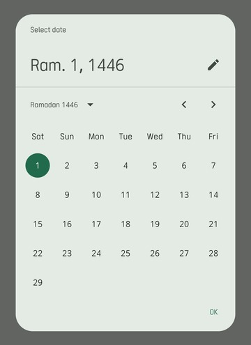
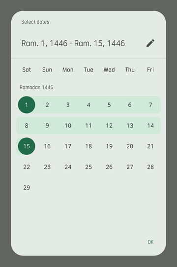
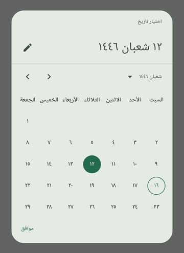
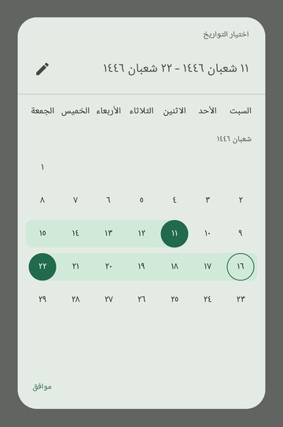
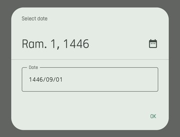
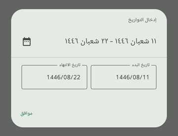

[](https://kotlinlang.org/)
[](https://kotlinlang.org/docs/multiplatform.html)
[](https://opensource.org/licenses/MIT)
[](https://www.paypal.com/paypalme/AbdulrahmanBahamel)

HijrahDateTime is a Kotlin Multiplatform library for working with the Hijrah calendar system. It provides a robust set of core classes and a modern set of Compose-based UI pickers to handle Hijrah dates and times across different platforms.

Starting from version 2.0, this library has been rewritten as a Kotlin Multiplatform project, providing first-class support for JVM, Android, iOS, and macOS.

> **Experimental / Alpha Notice (2.0.0-alpha07)**
>
> This release is experimental and provided "as-is". The API surface and behavior may change without notice.
> If you plan to use it in production, please share your feedback and suggestions.

---

## Table of Contents

- [Supported Platforms](#supported-platforms)
- [Installation](#installation)
- [Core Library](#core-library)
    - [Features](#core-features)
    - [Core Concepts](#core-concepts)
    - [Formatting and Parsing](#formatting-and-parsing)
    - [Serialization](#serialization)
    - [Ranges and Progressions](#ranges-and-progressions)
- [Compose Pickers](#compose-pickers)
    - [Features](#pickers-features)
    - [Screenshots](#screenshots)
    - [Usage](#pickers-usage)
- [License](#license)
- [Support Me](#support-me)

---

## Supported Platforms

- **JVM** (JDK 11+)
- **Android** (API 26+, JDK 11+)
- **iOS** (Arm64, Simulator Arm64)
- **macOS** (Arm64)

---

## Installation

Add the dependency to your `commonMain` source set:

```kotlin
kotlin {
    sourceSets {
        commonMain.dependencies {
            // Core library
            implementation("com.abdulrahman-b.hijrahdatetime:hijrahdatetime:2.0.0-alpha07")
            
            // Compose Pickers (for UI)
            implementation("com.abdulrahman-b.hijrahdatetime:hijrahdatetime-compose-pickers:2.0.0-alpha07")
        }
    }
}
```

---

## Core Library

### Core Features

- **Kotlin Multiplatform**: Supports JVM, Android, iOS, and macOS.
- **Core Types**: Includes `HijrahDate`, `HijrahDateTime`, `HijrahYearMonth`, and `HijrahMonth`.
- **Arithmetic**: Support for date/time arithmetic using `plus` and `minus` with `DatePeriod` and `DateTimeUnit`.
- **Formatting & Parsing**: Flexible formatting and parsing through `HijrahDateTimeFormat` and a DSL-based builder.
- **Serialization**: First-class support for `kotlinx-serialization`.
- **Integration**: Easy conversion to and from `kotlinx-datetime` types (`LocalDate`, `LocalDateTime`, `Instant`).
- **Ranges & Progressions**: Support for date ranges and progressions (e.g., `date1..date2`, `date1 downTo date2`).

### Core Concepts

#### HijrahDate
Represents a date (year, month, day) in the Hijrah calendar.
```kotlin
val date = HijrahDate(1446, 10, 12)
val tomorrow = date plusDays 1
val localDate = date.toLocalDate()
```

#### HijrahDateTime
Combines a `HijrahDate` with a `LocalTime`.
```kotlin
val dateTime = HijrahDateTime(1446, 10, 12, 12, 30, 0, 0)
```

#### HijrahYearMonth
Represents a specific year and month in the Hijrah calendar.
```kotlin
val yearMonth = HijrahYearMonth(1446, HijrahMonth.RAMADAN)
println(yearMonth.numberOfDays) // Number of days in Ramadan 1446
```

### Formatting and Parsing
```kotlin
val date = HijrahDate(1446, 10, 12)
val formatted = date.format(HijrahDateTimeFormats.DATE_ISO) // "1446-10-12"

// Using DSL builder
val dslFormat = buildDateTimeFormat {
    year(); char('/'); monthName(NameStyle.FULL); char('/'); dayOfMonth()
}
println(date.format(dslFormat)) // "1446/Shawwal/12"
```

### Serialization
Core types are annotated with `@Serializable`.
```kotlin
@Serializable
data class Event(val name: String, val date: HijrahDate)
```

### Ranges and Progressions
```kotlin
val start = HijrahDate(1446, 9, 1)
val end = HijrahDate(1446, 9, 30)
for (day in start..end) { println(day) }
```

---

## Compose Pickers

A modern and customizable set of Hijrah Date Pickers for Compose Multiplatform, inspired by Material3.

### Pickers Features

- **Modern Design** built with Material3 components.
- **Customizable** UI, locale, and behavior.
- **Single Date Selection**
- **Range Selection**
- **Multi-Date Selection**
- **Text Input Mode** support.

### Screenshots

|                            Single Picker                             |                                  Range Picker                                   |
|:--------------------------------------------------------------------:|:-------------------------------------------------------------------------------:|
|  |  |
|  |  |

|                            Input Mode                             |
|:-----------------------------------------------------------------:|
|             |
|  |

### Pickers Usage

The library provides three main components: `HijrahDatePicker`, `HijrahDateRangePicker`, and `HijrahMultiDatePicker`.

#### Single Date Picker Dialog
```kotlin
val datePickerState = rememberHijrahDatePickerState()
var openDialog by remember { mutableStateOf(false) }

if (openDialog) {
    DatePickerDialog(
        onDismissRequest = { openDialog = false },
        confirmButton = {
            TextButton(onClick = { 
                val selected = datePickerState.selectedDate
                openDialog = false 
            }) { Text("OK") }
        }
    ) {
        HijrahDatePicker(state = datePickerState)
    }
}
```

#### Date Range Picker Dialog
```kotlin
val rangePickerState = rememberHijrahDateRangePickerState()
// ... inside a dialog
HijrahDateRangePicker(state = rangePickerState)
```

---

## License

This project is licensed under the MIT License - see the [LICENSE](LICENSE) file for details.

---

## Support Me

If you find this project helpful, please consider supporting my work!

[](https://www.paypal.com/paypalme/AbdulrahmanBahamel)
